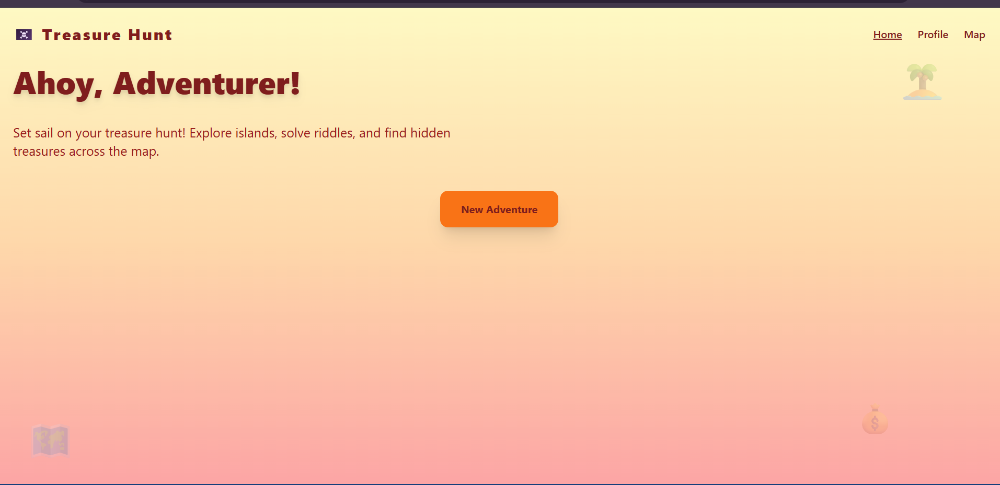
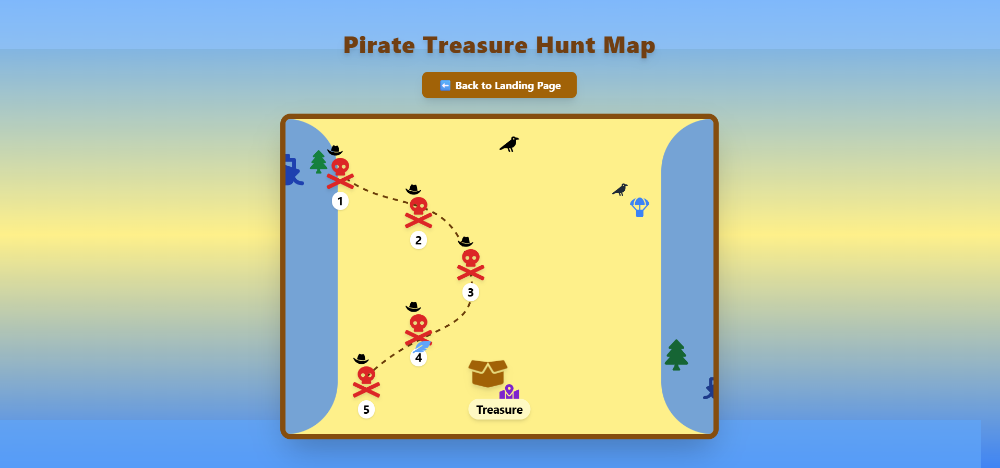
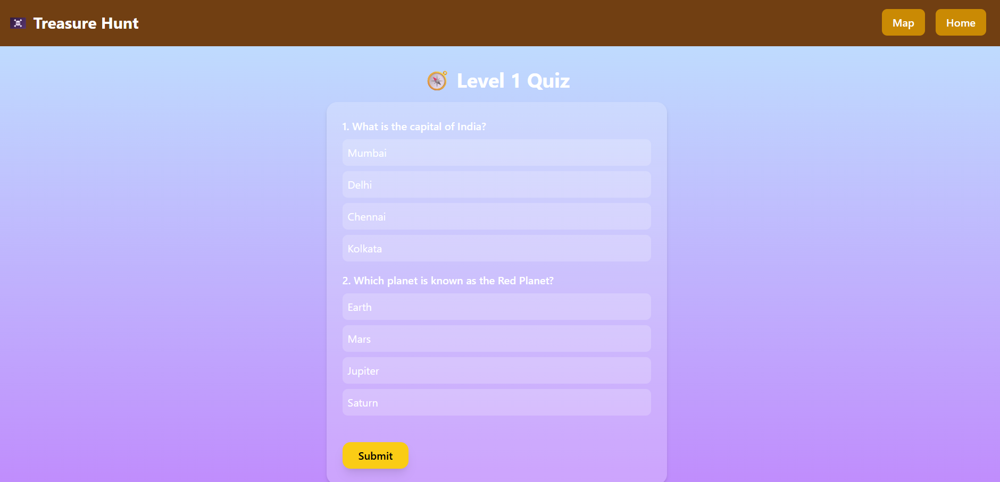
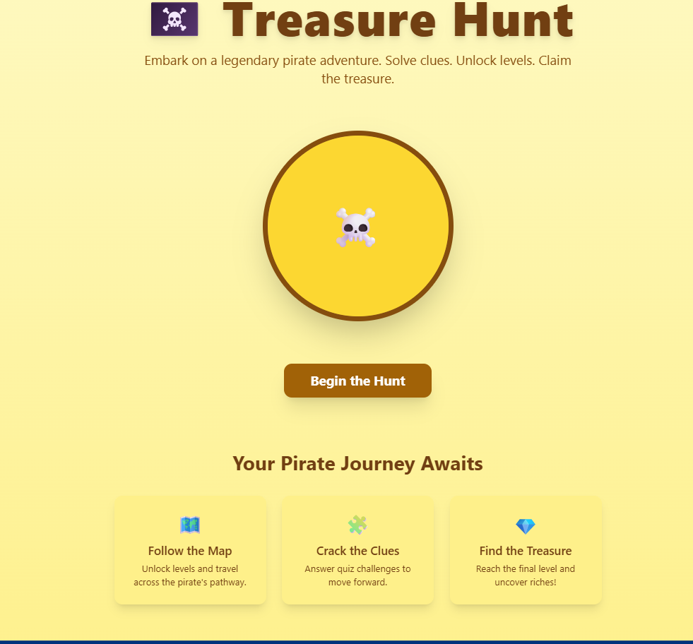

🏴‍☠️ Pirate Treasure Hunt — MERN Stack Adventure Game

A fully interactive Treasure Hunt game built using the MERN stack with animated maps, level-based quizzes, and pirate-themed UI.
Players unlock levels by answering questions and explore an interactive animated map to find the final treasure.

🚀 Live Demo

https://treasure-hunt-xi-seven.vercel.app/

🧭 Features
🎮 Gameplay

🌍 Interactive animated pirate map

🔒 Level-based progression (unlock next level after passing quiz)

❓ Quizzes for each level

🪙 Treasure unlock at the final level

🌀 Smooth animations (Framer Motion + AOS)

🛠 Tech Stack

Frontend

React (Vite)

TailwindCSS

Framer Motion

AOS Animations

React Icons

Backend

Node.js

Express.js

MongoDB + Mongoose

JWT Authentication

📸 Screenshots

🏡 Home Page

🗺 Map Page

❓ Quiz Page

🎉 Landing Page

📂 Project Structure
/backend
  /controllers
  /models
  /routes
  server.js
  seedQuiz.js

/frontend
  /src
    /pages
      HomePage.jsx
      MapPage.jsx
      QuizPage.jsx

⚙️ Setup Instructions
1️⃣ Clone Repository
git clone https://github.com/your-username/treasure-hunt.git
cd treasure-hunt

2️⃣ Backend Setup
cd backend
npm install

Create .env:

MONGODB_URI=your_mongodb_url
JWT_SECRET=your_secret_key
PORT=5000

Seed quiz questions:

node seedQuiz.js

Start backend:

npm start

3️⃣ Frontend Setup
cd ../frontend
npm install
npm run dev

Set frontend .env:

VITE_API_URL=http://localhost:5000

🧩 Game Logic
🏁 Starting the Game

User starts at level 1 and clicks New Adventure → goes directly to Quiz Level 1.

🔐 Level Unlocking

Score ≥ 70% → unlock next level

Score < 70% → retry same level

🗺 Map Access

Click any unlocked level on the pirate map to play its quiz.

🏆 Treasure Unlock

Completing the final level (Level 3) reveals the treasure chest animation.

🤝 Contributing

PRs are welcome! You can add more levels, animations, or game logic.
